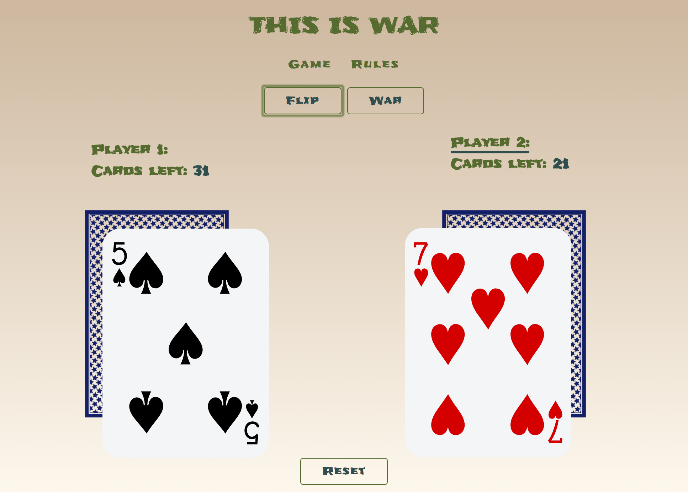
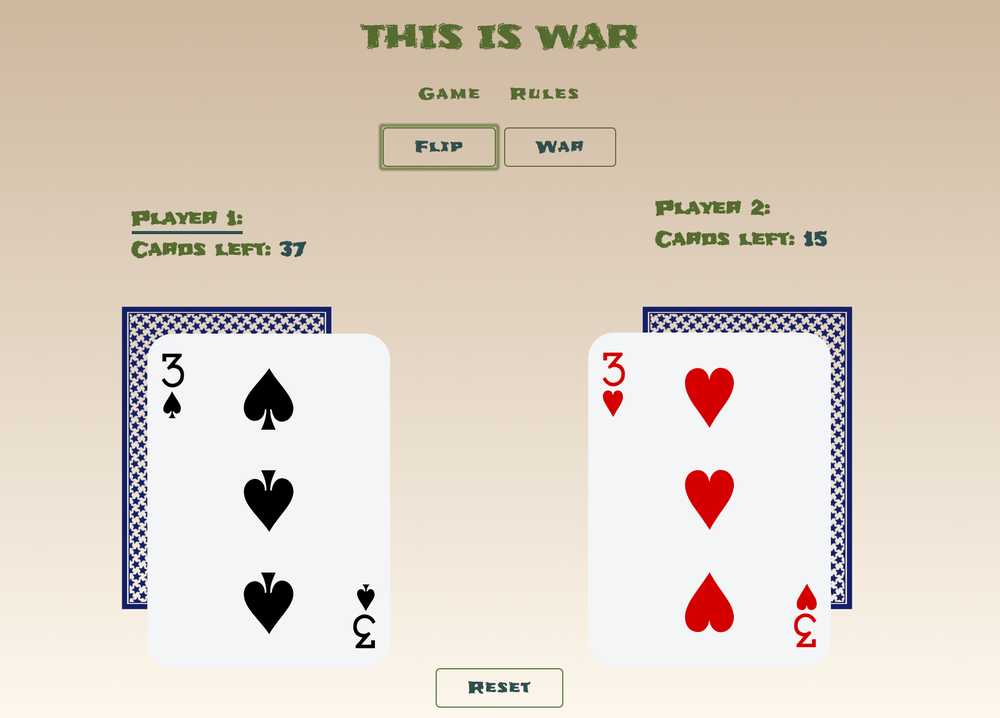
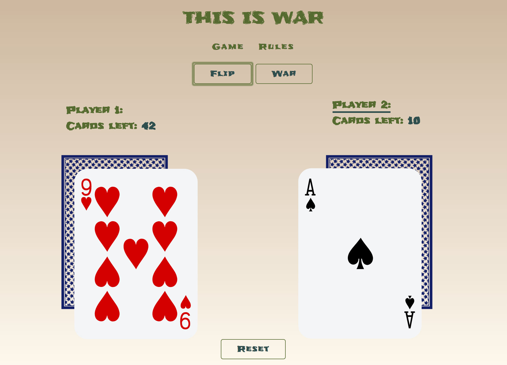
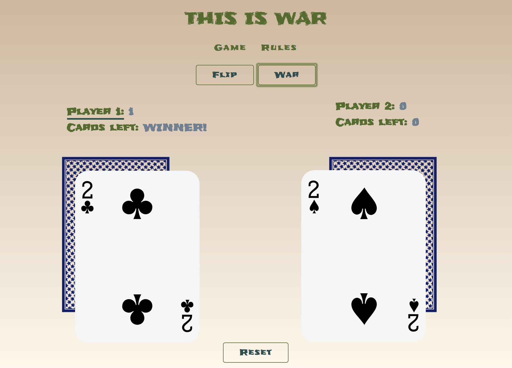
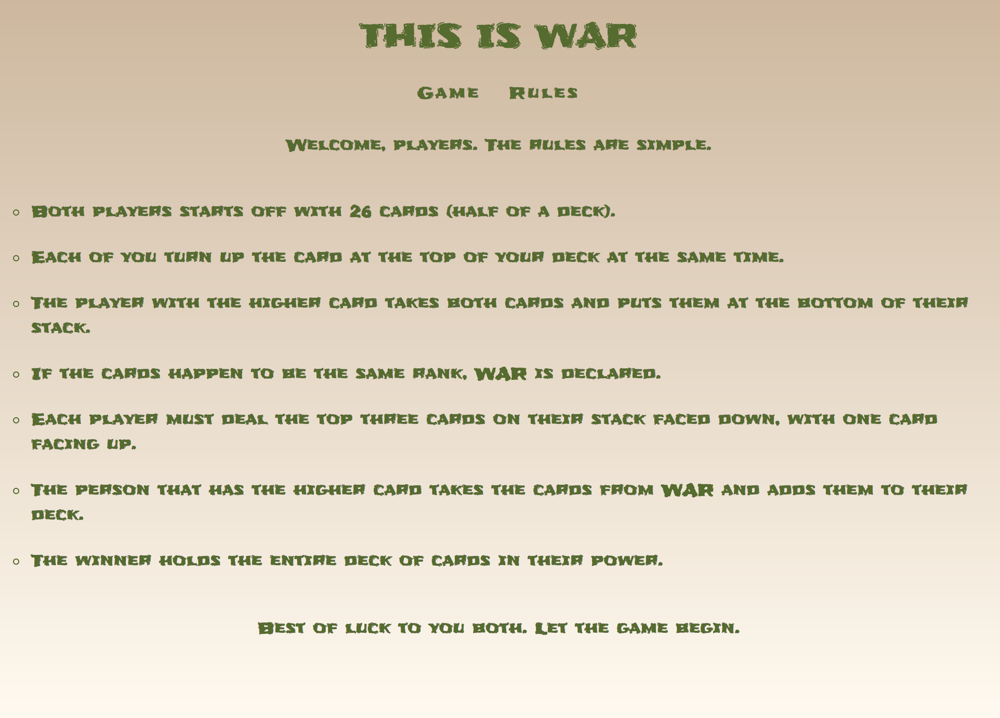

# This Is War

## Game Page

 Page will display: 

- The score of player 1 and player 2.
- The amount of cards each player has left in their possession.
- Flip button which allows players to flip the next card in their stack, which is the top card in their prospective arrays
    - Flip button only functions when the top card value from each player's array are not equal
    - Flip functionality is pictured below:
        
- War button that only works when a **WAR** takes place, as in the players have equal valued cards.
    - Flip button is deactivated at this point, so the players must press the war button in order to continue.
- War button can be used multiple times in-a-row when there are multiple wars declared.
    - When users have more than 5 cards in their possession, three cards will be flipped during war and then a fourth one for comparison.
    - When users have more than 4 cards in their possession, two cards will be flipped during war and then a third one for comparison.
    - When users have more than 3 cards in their possession, one card will be flipped during war and a second one for comparison.
    - If there is only one card left, the user with the higher amount of cards wins the game.
    - The user who has a higher card flipped after war has been declared takes all the cards that went into play. 
    - The process of war is pictured below:
        - War functionality pictured below:
        
        - Post-war functionality pictured below: 
        
- When one user has 0 cards left in their array, the score of the winning player will appear and the title of winner will be displayed next to the amount of cards left.
    - User who doesn't have any cards left has 0 cards left and their score remains the same.
    - Winner functionality pictured below:
        

## Rules Page

 Players will understand: 

- How many cards they get in each game.
- The standard of flipping cards for each turn.
- Who gets to take the cards in each turn.
- When  **WAR** takes place.
- What to do when **WAR** is declared.
- How a player wins the game.
- Rules layout pictured below: 
    